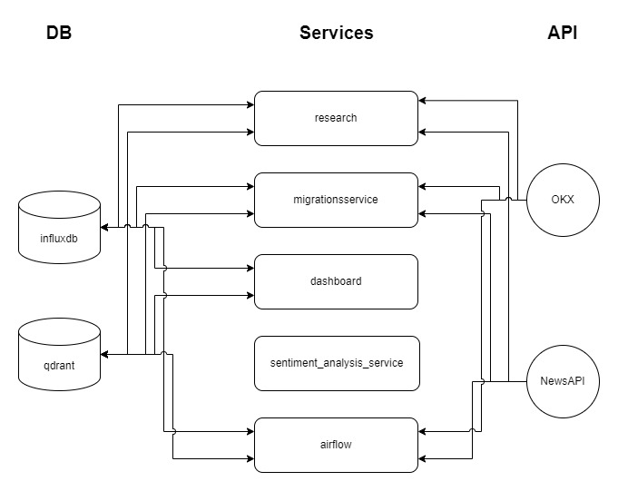

# ETL-BTC

В данном репозитории реализован ETL для котировки BTC/USDT и для новостей связанных с BTC. 

## Используемые технологии

Для Реализации ETL используются:
* `InfluxDB`
* `Qdrant`
* `AirFlow`
* `FastAPI` (на котором работают модели семантического анализа)
 
Для отслеживания пользователем заполнения БД информацией используется Dashboard реализованный с помощью `Streamlit`.

##  Описание компонентов

Были проведены исслеования, которые находятся в `research`, направленные на отбор способов сглаживания и фильтрации временных рядов и на отбор моделей BERT и LLM для семантического анализа новостей. 

Для первичного заполнения данными в БД используется сервис: `migrationsservice`

Компонент `dashboard` используется для визуализаций информации из БД. В свою очередь `sentiment_analysis_service` используется для семантического анализа входящих новостей. 

В `airflow` реализованы DAG-и для автоматизации ETL.

## Визуализация взаимодействия компонентов с БД и API

## Запуск системы

Для запуска системы требуется последовательно запустить комманды:

* `docker-compose up -d migrationsservice`
* `docker-compose up -d airflow-init`
* `docker-compose up -d dashboard`
* `docker-compose up -d airflow-webserver airflow-scheduler`

## Данные .env файла

Файл состои из:

* `NEWSAPI_KEY`
* `HUGGINGFACE_KEY`
* `INFLUXDB_INIT_MODE`
* `INFLUXDB_INIT_USERNAME`
* `INFLUXDB_INIT_PASSWORD`
* `INFLUXDB_INIT_ORG`
* `INFLUXDB_INIT_BUCKET`
* `INFLUXDB_INIT_ADMIN_TOKEN`

Данный файл должен хранится в каталогах:

* `sentiment_analysis_service`;
* `research`;
* `migrationsservice`;
* `dashboard`;
* `airflow`;
